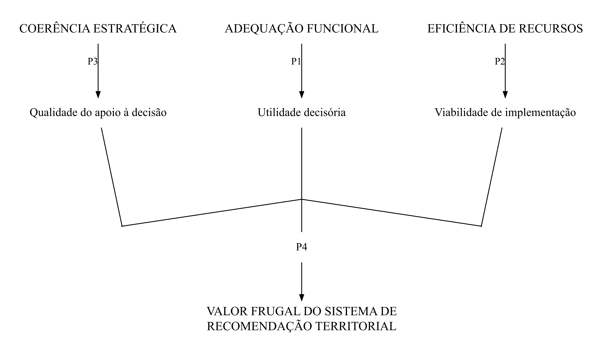

<div align="center">

# Frugal Evaluation of Recommender Systems in Territorial Marketing

### Ensaio teórico · Versão 2.0

**Theodora Holz · Universidade Federal do Rio Grande do Sul (UFRGS)**

Adequação funcional · Eficiência de recursos · Coerência estratégica

[Manuscrito](#manuscrito) · [Modelo teórico](#modelo-teórico) · [Dados](#dados-e-mapeamento-da-literatura) · [Reprodução](#como-executar) · [Citação](#como-citar)

</div>

---

## Sobre a pesquisa

Este repositório reúne o ensaio teórico e os materiais de apoio à investigação da **avaliação frugal de sistemas de recomendação no marketing territorial**. A questão central é como avaliar o valor desses sistemas para além de métricas isoladas de desempenho algorítmico.

O framework articula três dimensões interdependentes e suas consequências para o apoio à decisão territorial. Seu desenvolvimento é apoiado por um mapeamento estruturado da literatura, com registros bibliográficos, protocolo de busca e classificação computacional por regras em R.

> **Escopo científico:** trata-se de uma proposta teórica. As relações do modelo constituem proposições para investigação; os arquivos deste repositório não representam uma validação empírica do framework.

<details>
<summary><strong>Research overview in English</strong></summary>

This theoretical essay examines how recommender systems in territorial marketing can be evaluated through a frugal lens. Its relational framework connects functional adequacy with decision usefulness, resource efficiency with implementation viability, and strategic coherence with decision-support quality. Their interdependent operation constitutes the frugal value of territorial recommender systems. A structured literature mapping supports the theoretical development; the repository provides the manuscript, bibliographic records, classification data, R scripts, and figures.

</details>

## Manuscrito

| Arquivo | Versão de origem | Uso |
| :--- | :--- | :--- |
| [Ensaio teórico — DOCX](OSF_REVIEW_PROJECT_GITHUB/manuscript/ensaio-teorico-v2-comentarios.docx) | 20/07/2026 · identificado como “Comentários Brei” | Manuscrito mais recente localizado |
| [Ensaio teórico — PDF](OSF_REVIEW_PROJECT_GITHUB/manuscript/ensaio-teorico-2026-07-14.pdf) | 14/07/2026 | Versão disponível para leitura |

As datas são as de modificação dos arquivos de origem. O PDF é anterior ao DOCX e não deve ser entendido como sua exportação exata. Ambos foram preservados sem alterações editoriais.

## Modelo teórico

| Dimensão | Foco da avaliação | Consequência proposta |
| :--- | :--- | :--- |
| **Adequação funcional** | Correspondência entre capacidades do sistema e condições do problema territorial | Utilidade decisória |
| **Eficiência de recursos** | Proporcionalidade entre valor produzido e recursos mobilizados ao longo do ciclo de vida | Viabilidade de implementação |
| **Coerência estratégica** | Alinhamento das recomendações aos objetivos organizacionais, institucionais e territoriais | Qualidade do apoio à decisão |



**Figuras:** [relacional em inglês](OSF_REVIEW_PROJECT_GITHUB/figures/modelo_relacional_frugal_final.png) · [conceitual em português](OSF_REVIEW_PROJECT_GITHUB/figures/modelo_conceitual_frugal_port.png) · [conceitual em inglês](OSF_REVIEW_PROJECT_GITHUB/figures/frugal_conceptual_model_english.png) · [imagens e vetores](OSF_REVIEW_PROJECT_GITHUB/figures)

## Dados e mapeamento da literatura

Os dados foram sincronizados com a pasta de publicação `para publicar no osf/OSF_REVIEW_PROJECT_GITHUB`. As bases indicadas na documentação de origem são **Web of Science** e **Scopus**, com organização e triagem no **Rayyan**.

| Material | Acesso |
| :--- | :--- |
| Registros bibliográficos · 186 entradas | [RIS](OSF_REVIEW_PROJECT_GITHUB/data/raw/articles.ris) |
| Protocolo de busca | [XLSX](OSF_REVIEW_PROJECT_GITHUB/protocol/protocolo_busca_RSL.xlsx) |
| Classificação histórica para leitura | [CSV](OSF_REVIEW_PROJECT_GITHUB/data/processed/rayyan_186_classificacao_teorica_para_leitura.csv) · [XLSX](OSF_REVIEW_PROJECT_GITHUB/data/processed/rayyan_186_classificacao_teorica_para_leitura.xlsx) |

### Classificação registrada na planilha

| Sugestão | Registros |
| :--- | ---: |
| `NUCLEO_PROVAVEL` | 40 |
| `APOIO_PROVAVEL` | 102 |
| `EXCLUSAO_PROVAVEL` | 44 |
| **Total** | **186** |

Os 142 registros de núcleo e apoio são **sugestões de elegibilidade**. O campo `decisao_texto_completo` está vazio nos 186 registros; esta planilha, por si só, não comprova uma síntese final de 142 estudos após leitura integral. O CSV utiliza ponto e vírgula como separador.

### Limite de reprodução das classificações

Após a correção de uma referência à coluna `text_all`, o script distribuído gerou **42 CORE, 118 SUPPORT e 26 EXCLUDE** com os 186 registros. Esses resultados diferem da planilha histórica e são gravados separadamente em `classified_dataset.csv` e `classified_dataset.xlsx`.

As regras não foram alteradas para forçar correspondência com os totais históricos. A reconciliação entre o script e a classificação arquivada permanece pendente. Consulte os [detalhes de procedência e validação](PROVENANCE.md).

## Organização do repositório

```text
.
├── README.md                  # Apresentação e guia de uso
├── CITATION.cff                # Metadados de citação da versão 2.0
├── CHANGELOG.md                # Histórico das versões
├── PROVENANCE.md               # Origem dos arquivos e validação
├── LICENSE                    # Licença MIT existente
└── OSF_REVIEW_PROJECT_GITHUB/
    ├── manuscript/            # Ensaio teórico em DOCX e PDF
    ├── data/
    │   ├── raw/               # RIS e cópia do protocolo
    │   └── processed/         # Classificação histórica em CSV e XLSX
    ├── protocol/              # Protocolo de busca
    ├── scripts/               # Classificação e figuras em R
    ├── figures/               # Modelos conceitual e relacional
    └── Readme/                # Acesso à documentação principal
```

## Como executar

**Ambiente verificado:** R 4.4.3 no Windows. Execute no console do R, inicialmente na raiz do repositório:

```r
install.packages(c("revtools", "dplyr", "stringr", "openxlsx", "tibble"))
setwd("OSF_REVIEW_PROJECT_GITHUB")
source("scripts/script_classification_pipeline.R", encoding = "UTF-8")
```

O diretório de trabalho deve ser `OSF_REVIEW_PROJECT_GITHUB`: o script lê `data/raw/articles.ris` e escreve em `data/processed/`. Os arquivos históricos `rayyan_186_*` são preservados.

### Gerar as figuras

Na mesma sessão, a partir de `OSF_REVIEW_PROJECT_GITHUB`:

```r
install.packages(c("DiagrammeR", "DiagrammeRsvg", "rsvg"))
setwd("figures")
source("../scripts/venglish.R", encoding = "UTF-8")
source("../scripts/vportugues.R", encoding = "UTF-8")
source("../scripts/modelo_relacional_pt.R", encoding = "UTF-8")
setwd("..")
```

Os scripts salvam PNG e SVG na pasta de trabalho e podem sobrescrever figuras de mesmo nome. O script conceitual em português gera `modelo_conceitual_frugal_corrigido.*`. O modelo relacional em inglês está disponível como imagem e SVG; não há um script em inglês preenchido na fonte local.

## Versionamento

| Versão | Conteúdo |
| :--- | :--- |
| [1.0](https://github.com/theodoraholz-hue/frugal-recommender-system-osf/tree/v1.0.0) | Estado anterior do repositório, preservado integralmente |
| **2.0** | Manuscrito mais recente, figuras complementares, documentação reorganizada e correção de execução do script |

O [histórico de alterações](CHANGELOG.md) descreve a atualização. A data da versão do repositório é distinta das datas dos manuscritos.

## Como citar

> Holz, T. (2026). *Frugal Evaluation of Recommender Systems in Territorial Marketing* (versão 2.0.0). GitHub. https://github.com/theodoraholz-hue/frugal-recommender-system-osf

Os metadados estão em [CITATION.cff](CITATION.cff), compatível com **Cite this repository** do GitHub. Esta referência é ao repositório; não implica publicação em periódico nem registro de DOI.

## Autoria e licença

**Theodora Holz** · Universidade Federal do Rio Grande do Sul (UFRGS)
[Perfil no GitHub](https://github.com/theodoraholz-hue) · [Questões sobre os materiais](https://github.com/theodoraholz-hue/frugal-recommender-system-osf/issues)

A licença [MIT](LICENSE) existente foi mantida. Os registros bibliográficos preservam os créditos e avisos de direitos de suas fontes.
